# Thor-Hammer-Mechanics
I made Thor's hammer mechanics in unreal engine 5 using blueprint

## Demo

## Mjolnir (Hammer)
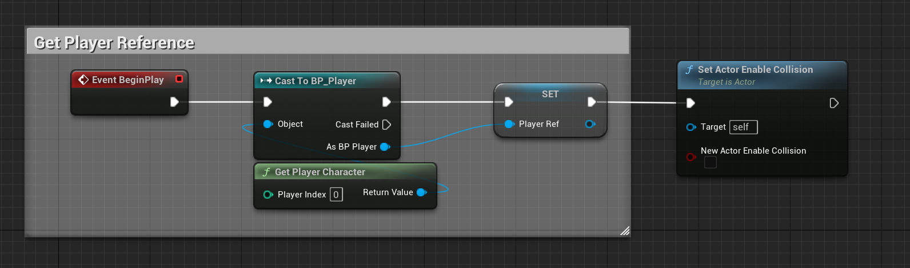</img>
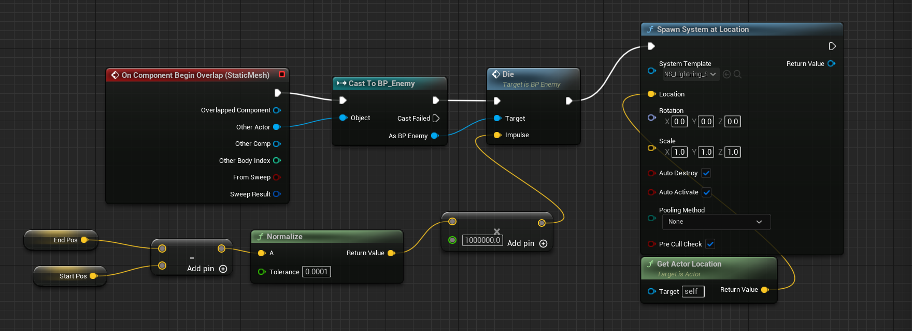</img>
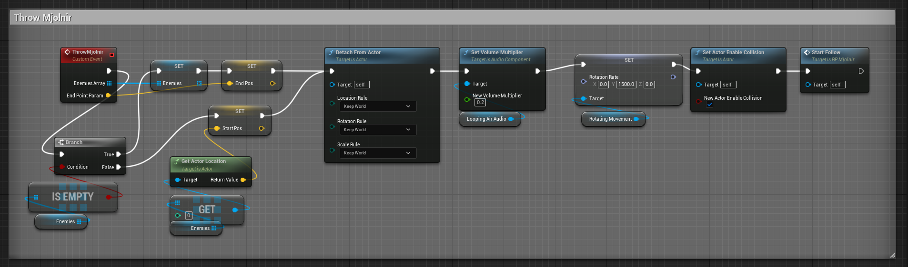</img>
</img>
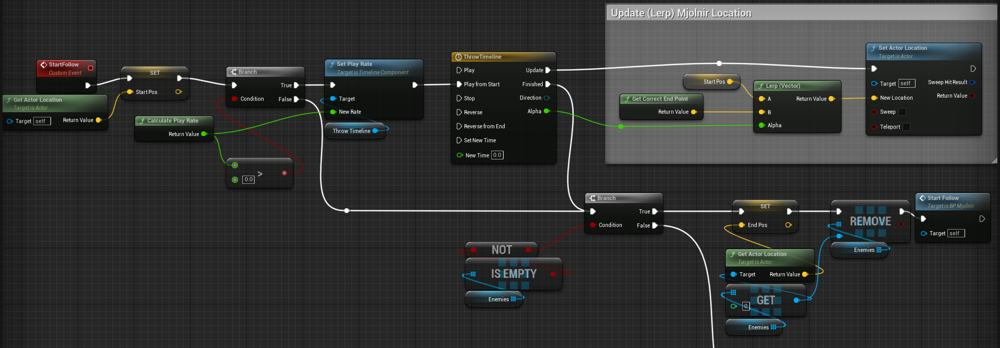</img>
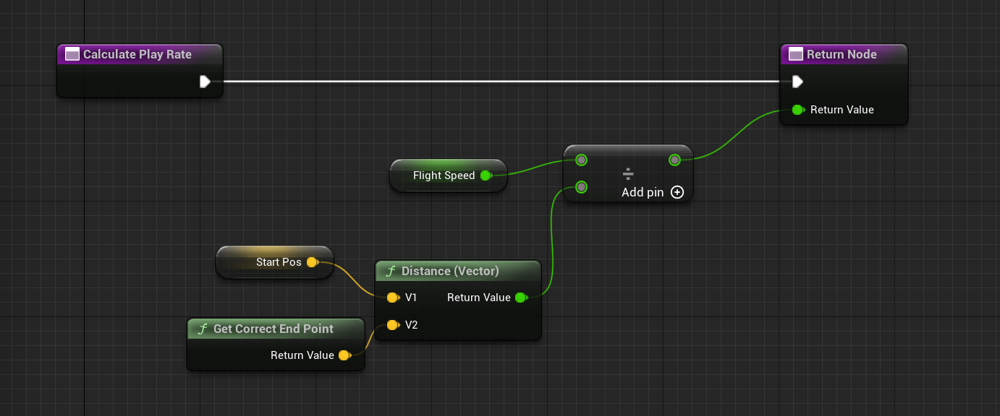</img>
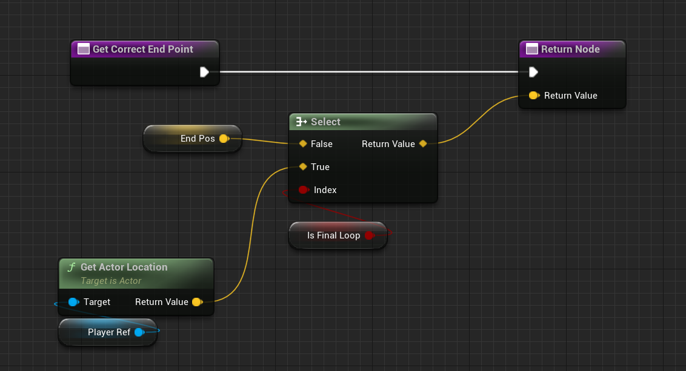</img>

## Thor
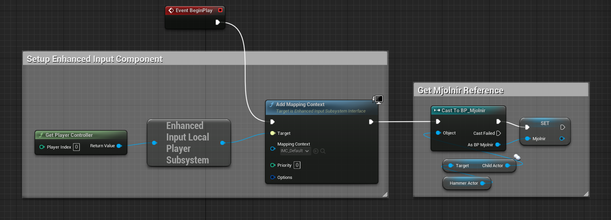</img>
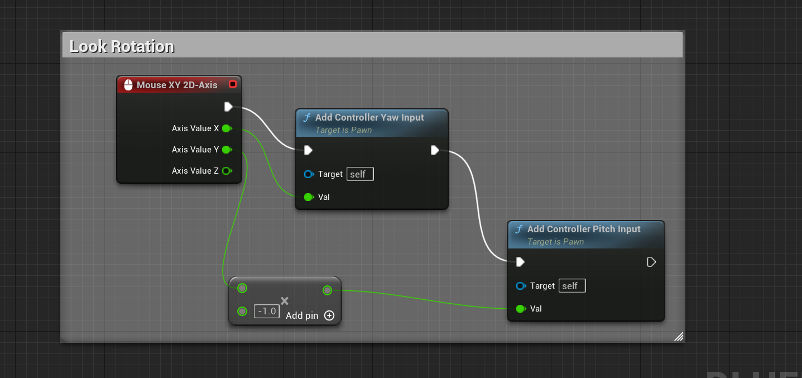</img>
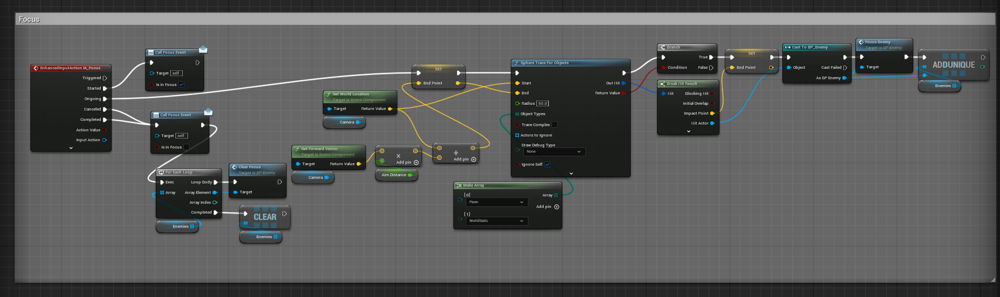</img>
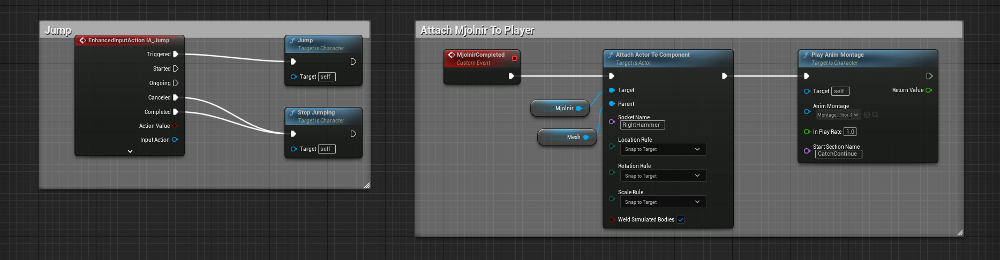</img>
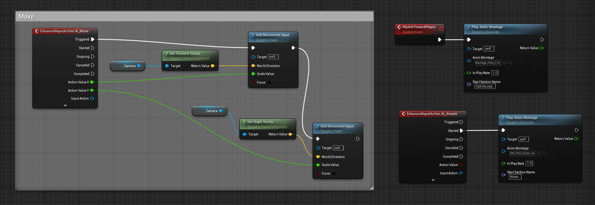</img>
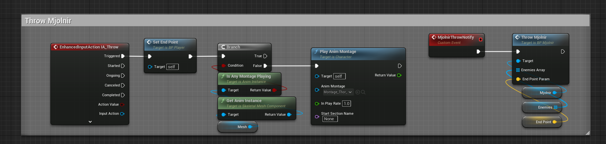</img>
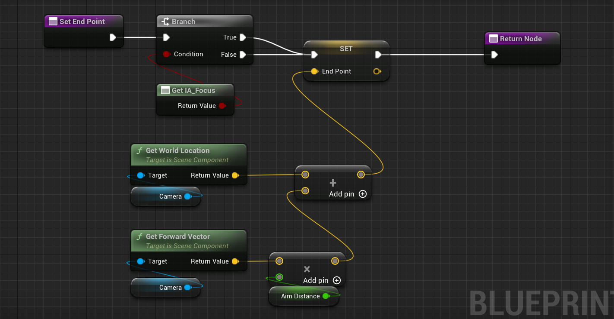</img>

## Giant (Enemy)
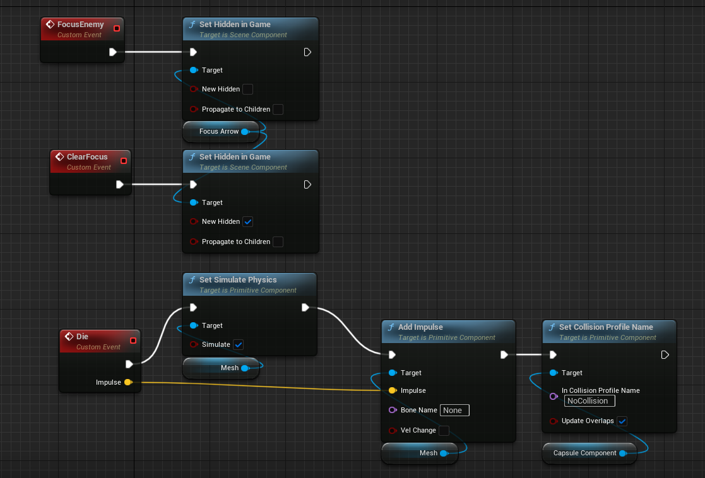</img>

